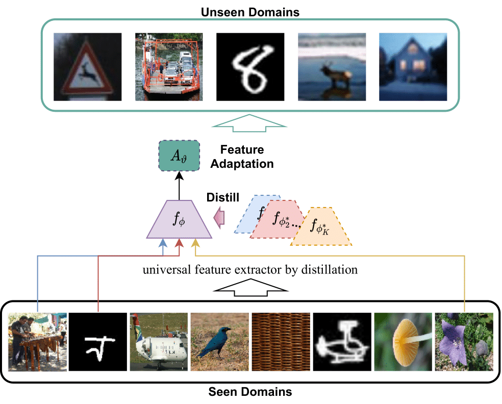

# Universal Representation Learning and Task-specific Adaptation for Few-shot Learning 
A universal representation learning algorithm that learns a set of well-generalized representations via a single universal network from multiple diverse visual datasets and task-specific adaptation techniques for few-shot learning.

<p align="center">
  
</p>

> [**Universal Representation Learning from Multiple Domains for Few-shot Classification**](https://arxiv.org/abs/2103.13841),            
> Wei-Hong Li, Xialei Liu, Hakan Bilen,        
> *ICCV 2021 ([arXiv 2103.13841](https://arxiv.org/abs/2103.13841))*  
>
> [**Cross-domain Few-shot Learning with Task-specific Adapters**](https://arxiv.org/abs/2107.00358),            
> Wei-Hong Li, Xialei Liu, Hakan Bilen,        
> *CVPR 2022 ([arXiv 2107.00358](https://arxiv.org/abs/2107.00358))*  
>
> [**Universal Representations: A Unified Look at Multiple Task and Domain Learning**](https://arxiv.org/abs/2204.02744),            
> Wei-Hong Li, Xialei Liu, Hakan Bilen,        
> *Preprint 2022 ([arXiv 2204.02744](https://arxiv.org/abs/2204.02744))* 

## Updates
* March'22, Code for [Cross-domain Few-shot Learning with Task-specific Adapters](https://arxiv.org/pdf/2107.00358.pdf) (CVPR'22) is now available! See [TSA](#cross-domain-few-shot-learning-with-task-specific-adapters).
* Oct'21, Code and models for [Universal Representation Learning from Multiple Domains for Few-shot Classification](https://arxiv.org/pdf/2103.13841.pdf) (ICCV'21) are now available!

## Features at a glance
- We train a single universal (task-agnostic) network on 8 visual (training) datasets on Meta-dataset: ImageNet, Omniglot, Aircraft, Birds, Textures, Quick Draw, Fungi, VGG Flower, with state-of-the-art performances on all (13) testing datasets for few-shot learning.

- During meta-testing, the universal representations can be efficiently adapted by our proposed pre-classifier alignment (a linear transformation) learned on the support set to transform the representations to a more discriminative space.

- We propose to attach a set of light weight task-specific adapters to the universal network (the universal network can be learned from multiple datasets or one single diverse dataset, e.g. ImageNet) and learn task-specific adapters on the support set from scratch for adapting the few-shot model to the tasks from unseen domains.

- We systematically study various combinations of several design choices for task-specific adaptation, which have not been explored before, including adapter connection types (serial or residual), parameterizations (matrix and its decomposed variations, channelwise operations) and estimation of task-specific parameters.

- Attaching parameteric adapters in matrix form to convolutional layers with residual connections significantly boosts the state-of-the-art performance in most domains, especially resulting in superior performance in unseen domains on Meta-Dataset

- In this repo, we provide code of the URL, the best task adaptation strategy in TSA, and other baselines like SDL, vanilla MDL and other evaluation settings. 

## Main results on [Meta-dataset](https://github.com/google-research/meta-dataset)
- Multi-domain setting (meta-train on 8 datasets and meta-test on 13 datasets).

Test Datasets              |TSA (Ours)                 |URL (Ours)                 |MDL                        |Best SDL                   |tri-M [8]                  |FLUTE [7]                  |URT [6]                    |SUR [5]                    |Transductive CNAPS [4]     |Simple CNAPS [3]           |CNAPS [2]                  
---------------------------|---------------------------|---------------------------|---------------------------|---------------------------|---------------------------|---------------------------|---------------------------|---------------------------|---------------------------|---------------------------|---------------------------
Avg rank                   |**1.5**                    |2.7                        |7.1                        |6.7                        |5.5                        |5.1                        |6.7                        |6.9                        |5.7                        |7.2                        |-                        
Avg Seen                   |**80.2**                   |80.0                       |76.9                       |76.3                       |74.5                       |76.2                       |76.7                       |75.2                       |75.1                       |74.6                       |71.6                       
Avg Unseen                 |**77.2**                   |69.3                       |61.7                       |61.9                       |69.9                       |69.9                       |62.4                       |63.1                       |66.5                       |65.8                       |-                        
Avg All                    |**79.0**                   |75.9                       |71.1                       |70.8                       |72.7                       |73.8                       |71.2                       |70.5                       |71.8                       |71.2                       |-                        


- Single-domain setting (Meta-train on ImageNet and meta-test on 13 datasets).

Test Datasets              |TSA-ResNet34 (Ours)        |TSA-ResNet18 (Ours)        |CTX-ResNet34 [10]          |ProtoNet-ResNet34 [10]     |FLUTE [7]                  |BOHB [9]                   |ALFA+fo-Proto-MAML [1]     |fo-Proto-MAML [1]          |ProtoNet [1]               |Finetune [1]               
---------------------------|---------------------------|---------------------------|---------------------------|---------------------------|---------------------------|---------------------------|---------------------------|---------------------------|---------------------------|---------------------------
Avg rank                   |**1.5**                    |2.8                        |1.8                        |5.5                        |8.9                        |6.0                        |5.3                        |7.0                        |8.3                        |7.9                        
Avg Seen                   |**63.7**                   |59.5                       |62.8                       |53.7                       |46.9                       |51.9                       |52.8                       |49.5                       |50.5                       |45.8                       
Avg Unseen                 |**76.2**                   |71.9                       |75.6                       |61.1                       |53.2                       |60.0                       |62.4                       |58.4                       |56.7                       |58.2                       
Avg All                    |**74.9**                   |70.7                       |74.3                       |60.4                       |52.6                       |59.2                       |61.4                       |57.5                       |56.1                       |57.0                       

## Model Zoo
- [Single-domain networks (one for each dataset)](https://drive.google.com/file/d/1MvUcvQ8OQtoOk1MIiJmK6_G8p4h8cbY9/view?usp=sharing)

- [A single universal network (URL) learned from 8 training datasets](https://drive.google.com/file/d/1Dv8TX6iQ-BE2NMpfd0sQmH2q4mShmo1A/view?usp=sharing)

- ImageNet model learned with ResNet34 and higher resolution images (224x224) like CTX [10], coming soon!

## Dependencies
This code requires the following:
* Python 3.6 or greater
* PyTorch 1.0 or greater
* TensorFlow 1.14 or greater

## Installation
* Clone or download this repository.
* Configure Meta-Dataset:
    * Follow the "User instructions" in the [Meta-Dataset repository](https://github.com/google-research/meta-dataset) for "Installation" and "Downloading and converting datasets".
    * Edit ```./meta-dataset/data/reader.py``` in the meta-dataset repository to change ```dataset = dataset.batch(batch_size, drop_remainder=False)``` to ```dataset = dataset.batch(batch_size, drop_remainder=True)```. (The code can run with ```drop_remainder=False```, but in our work, we drop the remainder such that we will not use very small batch for some domains and we recommend to drop the remainder for reproducing our methods.)
    * To test unseen domain (out-of-domain) performance on additional datasets, i.e. MNIST, CIFAR-10 and CIFAR-100, follow the installation instruction in the [CNAPs repository](https://github.com/cambridge-mlg/cnaps) to get these datasets.

## Initialization
1. Before doing anything, first run the following commands.
    ```
    ulimit -n 50000
    export META_DATASET_ROOT=<root directory of the cloned or downloaded Meta-Dataset repository>
    export RECORDS=<the directory where tf-records of MetaDataset are stored>
    ```
    
    Note the above commands need to be run every time you open a new command shell.

2. Enter the root directory of this project, i.e. the directory where this project was cloned or downloaded.


## Universal Representation Learning from Multiple Domains for Few-shot Classification
<p align="center">
  
</p>
<p align="center">
    Figure 1. <b>URL - Universal Representation Learning</b>.
</p>


### Train the Universal Representation Learning Network
1. The easiest way is to download our [pre-trained URL model](https://drive.google.com/file/d/1Dv8TX6iQ-BE2NMpfd0sQmH2q4mShmo1A/view?usp=sharing) and evaluate its feature using our Pre-classifier Alignment (PA). To download the pretrained URL model, one can use `gdown` (installed by ```pip install gdown```) and execute the following command in the root directory of this project:
    ```
    gdown https://drive.google.com/uc?id=1Dv8TX6iQ-BE2NMpfd0sQmH2q4mShmo1A && md5sum url.zip && unzip url.zip -d ./saved_results/ && rm url.zip
    
    ```
    This will donwnload the URL model and place it in the ```./saved_results``` directory. One can evaluate this model by our PA (see the [Meta-Testing step](#meta-testing-with-pre-classifier-alignment-pa))

2. Alternatively, one can train the model from scratch: 1) train 8 single domain learning networks; 2) train the universal feature extractor as follow. 

#### Train Single Domain Learning Networks
1. The easiest way is to download our [pre-trained models](https://drive.google.com/file/d/1MvUcvQ8OQtoOk1MIiJmK6_G8p4h8cbY9/view?usp=sharing) and use them to obtain a universal set of features directly. To download single domain learning networks, execute the following command in the root directory of this project:
    ```
    gdown https://drive.google.com/uc?id=1MvUcvQ8OQtoOk1MIiJmK6_G8p4h8cbY9 && md5sum sdl.zip && unzip sdl.zip -d ./saved_results/ && rm sdl.zip
    ```

    This will download all single domain learning models and place them in the ```./saved_results``` directory of this project.


2. Alternatively, instead of using the pretrained models, one can train the models from scratch.
   To train 8 single domain learning networks, run:
    ```
    ./scripts/train_resnet18_sdl.sh
    ```


#### Train the Universal Feature Extractor
To learn the universal feature extractor by distilling the knowledge from pre-trained single domain learning networks, run: 
```
./scripts/train_resnet18_url.sh
```

### Meta-Testing with Pre-classifier Alignment (PA)
<p align="center">
  
</p>
<p align="center">
    Figure 2. <b>PA - Pre-classifier Alignment</b> for Adapting Features in Meta-test.
</p>

This step would run our Pre-classifier Alignment (PA) procedure per task to adapt the features to a discriminate space and build a Nearest Centroid Classifier (NCC) on the support set to classify query samples, run:

```
./scripts/test_resnet18_pa.sh
```

## Cross-domain Few-shot Learning with Task-specific Adapters
<p align="center">
  
</p>
<p align="center">
    Figure 3. Cross-domain Few-shot Learning with <b>Task-specific Adapters (TSA)</b>.
</p>

We provide code for attaching task-specific adapters (TSA) to a single universal network learned from meta-train and learn the task-specific adapters on the support set. One can download our [pre-trained URL model](https://drive.google.com/file/d/1Dv8TX6iQ-BE2NMpfd0sQmH2q4mShmo1A/view?usp=sharing) (see [here](#train-the-universal-representation-learning-network) to download the URL or SDL models or train them from scratch) and evaluate its feature adapted by residual adapters in matrix form and pre-classifier alignment, run:
```
./scripts/test_resnet18_tsa.sh
```

One may want to train the model from scratch from the Meta-training step. For single-domain learning network, see [here](#train-single-domain-learning-networks) to learn a single network from ImageNet with ResNet-18. For multi-domain learning setting, one can learn a URL model (see [here](#train-the-universal-representation-learning-network)) or learn a vanilla MDL model (see [here](#train-a-vanilla-multi-domain-learning-network)). Note that, one may need to amend the input of `--model.name` and `--model.dir` in `./scripts/test_resnet18_tsa.sh` to the model learned from meta-training and amend `--test.mode` to `sdl` if the backbone is learned from ImageNet only in meta-training and then run the TSA.

## Expected Results
Below are the results extracted from our papers. The results will vary from run to run by a percent or two up or down due to the fact that the Meta-Dataset reader generates different tasks each run, randomnes in training the networks and in TSA and PA optimization. Note, the results are updated with the up-to-date evaluation from Meta-Dataset. Make sure that you use the up-to-date code from the Meta-Dataset repository to convert the dataset and set ```shuffle_buffer_size=1000``` as mentioned in https://github.com/google-research/meta-dataset/issues/54.

**Models trained on all datasets**

Test Datasets              |TSA (Ours)                 |URL (Ours)                    |MDL                        |Best SDL                   |tri-M [8]                  |FLUTE [7]                  |URT [6]                    |SUR [5]                    |Transductive CNAPS [4]     |Simple CNAPS [3]           |CNAPS [2]                  
---------------------------|---------------------------|---------------------------|---------------------------|---------------------------|---------------------------|---------------------------|---------------------------|---------------------------|---------------------------|---------------------------|---------------------------
Avg rank                   |**1.5**                    |2.7                        |7.1                        |6.7                        |5.5                        |5.1                        |6.7                        |6.9                        |5.7                        |7.2                        |-                        
ImageNet                   |**57.4±1.1**&nbsp;         |**57.5±1.1**&nbsp;         |52.9±1.2&nbsp;             |54.3±1.1&nbsp;             |**58.6±1.0**&nbsp;         |51.8±1.1&nbsp;             |55.0±1.1&nbsp;             |54.5±1.1&nbsp;             |**57.9±1.1**&nbsp;         |56.5±1.1&nbsp;             |50.8±1.1&nbsp;             
Omniglot                   |**95.0±0.4**&nbsp;         |**94.5±0.4**&nbsp;         |93.7±0.5&nbsp;             |93.8±0.5&nbsp;             |92.0±0.6&nbsp;             |93.2±0.5&nbsp;             |93.3±0.5&nbsp;             |93.0±0.5&nbsp;             |94.3±0.4&nbsp;             |91.9±0.6&nbsp;             |91.7±0.5&nbsp;             
Aircraft                   |**89.3±0.4**&nbsp;         |88.6±0.5&nbsp;             |84.9±0.5&nbsp;             |84.5±0.5&nbsp;             |82.8±0.7&nbsp;             |87.2±0.5&nbsp;             |84.5±0.6&nbsp;             |84.3±0.5&nbsp;             |84.7±0.5&nbsp;             |83.8±0.6&nbsp;             |83.7±0.6&nbsp;             
Birds                      |**81.4±0.7**&nbsp;         |**80.5±0.7**&nbsp;         |79.2±0.8&nbsp;             |70.6±0.9&nbsp;             |75.3±0.8&nbsp;             |79.2±0.8&nbsp;             |75.8±0.8&nbsp;             |70.4±1.1&nbsp;             |78.8±0.7&nbsp;             |76.1±0.9&nbsp;             |73.6±0.9&nbsp;             
Textures                   |**76.7±0.7**&nbsp;         |**76.2±0.7**&nbsp;         |70.9±0.8&nbsp;             |72.1±0.7&nbsp;             |71.2±0.8&nbsp;             |68.8±0.8&nbsp;             |70.6±0.7&nbsp;             |70.5±0.7&nbsp;             |66.2±0.8&nbsp;             |70.0±0.8&nbsp;             |59.5±0.7&nbsp;             
Quick Draw                 |**82.0±0.6**&nbsp;         |**81.9±0.6**&nbsp;         |81.7±0.6&nbsp;             |**82.6±0.6**&nbsp;         |77.3±0.7&nbsp;             |79.5±0.7&nbsp;             |**82.1±0.6**&nbsp;         |81.6±0.6&nbsp;             |77.9±0.6&nbsp;             |78.3±0.7&nbsp;             |74.7±0.8&nbsp;             
Fungi                      |**67.4±1.0**&nbsp;         |**68.8±0.9**&nbsp;         |63.2±1.1&nbsp;             |65.9±1.0&nbsp;             |48.5±1.0&nbsp;             |58.1±1.1&nbsp;             |63.7±1.0&nbsp;             |65.0±1.0&nbsp;             |48.9±1.2&nbsp;             |49.1±1.2&nbsp;             |50.2±1.1&nbsp;             
VGG Flower                 |**92.2±0.5**&nbsp;         |**92.1±0.5**&nbsp;         |88.7±0.6&nbsp;             |86.7±0.6&nbsp;             |90.5±0.5&nbsp;             |**91.6±0.6**&nbsp;         |88.3±0.6&nbsp;             |82.2±0.8&nbsp;             |**92.3±0.4**&nbsp;         |91.3±0.6&nbsp;             |88.9±0.5&nbsp;             
Traffic Sign               |**83.5±0.9**&nbsp;         |63.3±1.2&nbsp;             |49.2±1.0&nbsp;             |47.1±1.1&nbsp;             |63.0±1.0&nbsp;             |58.4±1.1&nbsp;             |50.1±1.1&nbsp;             |49.8±1.1&nbsp;             |59.7±1.1&nbsp;             |59.2±1.0&nbsp;             |56.5±1.1&nbsp;             
MSCOCO                     |**55.8±1.1**&nbsp;         |54.0±1.0&nbsp;             |47.3±1.1&nbsp;             |49.7±1.0&nbsp;             |52.8±1.1&nbsp;             |50.0±1.0&nbsp;             |48.9±1.1&nbsp;             |49.4±1.1&nbsp;             |42.5±1.1&nbsp;             |42.4±1.1&nbsp;             |39.4±1.0&nbsp;             
MNIST                      |**96.7±0.4**&nbsp;         |94.5±0.5&nbsp;             |94.2±0.4&nbsp;             |91.0±0.5&nbsp;             |96.2±0.3&nbsp;             |95.6±0.5&nbsp;             |90.5±0.4&nbsp;             |94.9±0.4&nbsp;             |94.7±0.3&nbsp;             |94.3±0.4&nbsp;             |-         
CIFAR-10                   |**80.6±0.8**&nbsp;         |71.9±0.7&nbsp;             |63.2±0.8&nbsp;             |65.4±0.8&nbsp;             |75.4±0.8&nbsp;             |78.6±0.7&nbsp;             |65.1±0.8&nbsp;             |64.2±0.9&nbsp;             |73.6±0.7&nbsp;             |72.0±0.8&nbsp;             |-         
CIFAR-100                  |**69.6±1.0**&nbsp;         |62.6±1.0&nbsp;             |54.7±1.1&nbsp;             |56.2±1.0&nbsp;             |62.0±1.0&nbsp;             |67.1±1.0&nbsp;             |57.2±1.0&nbsp;             |57.1±1.1&nbsp;             |61.8±1.0&nbsp;             |60.9±1.1&nbsp;             |- 

<div style="text-align:justify; font-size:80%">
    <p>
        [1] Eleni Triantafillou, Tyler Zhu, Vincent Dumoulin, Pascal Lamblin, Utku Evci, Kelvin Xu, Ross Goroshin, Carles Gelada, Kevin Swersky, Pierre-Antoine Manzagol, Hugo Larochelle; <a href="https://arxiv.org/abs/1903.03096">Meta-Dataset: A Dataset of Datasets for Learning to Learn from Few Examples</a>; ICLR 2020.
    </p>
    <p>
        [2] James Requeima, Jonathan Gordon, John Bronskill, Sebastian Nowozin, Richard E. Turner; <a href="https://arxiv.org/abs/1906.07697">Fast and Flexible Multi-Task Classification Using Conditional Neural Adaptive Processes</a>; NeurIPS 2019.
    </p>
    <p>
        [3] Peyman Bateni, Raghav Goyal, Vaden Masrani, Frank Wood, Leonid Sigal; <a href="https://openaccess.thecvf.com/content_CVPR_2020/html/Bateni_Improved_Few-Shot_Visual_Classification_CVPR_2020_paper.html">Improved Few-Shot Visual Classification</a>; CVPR 2020.
    </p>
    <p>
        [4] Peyman Bateni, Jarred Barber, Jan-Willem van de Meent, Frank Wood; <a href="https://openaccess.thecvf.com/content/WACV2022/papers/Bateni_Enhancing_Few-Shot_Image_Classification_With_Unlabelled_Examples_WACV_2022_paper.pdf">Enhancing Few-Shot Image Classification with Unlabelled Examples</a>; WACV 2022.
    </p>
    <p>
        [5] Nikita Dvornik, Cordelia Schmid, Julien Mairal; <a href="ttps://arxiv.org/abs/2003.09338">Selecting Relevant Features from a Multi-domain Representation for Few-shot Classification</a>; ECCV 2020.
    </p>
    <p>
        [6] Lu Liu, William Hamilton, Guodong Long, Jing Jiang, Hugo Larochelle; <a href="https://arxiv.org/abs/2006.11702">Universal Representation Transformer Layer for Few-Shot Image Classification</a>; ICLR 2021.
    </p>
    <p>
        [7] Eleni Triantafillou, Hugo Larochelle, Richard Zemel, Vincent Dumoulin; <a href="https://arxiv.org/pdf/2105.07029.pdf">Learning a Universal Template for Few-shot Dataset Generalization</a>; ICML 2021.
    </p>
    <p>
        [8] Yanbin Liu, Juho Lee, Linchao Zhu, Ling Chen, Humphrey Shi, Yi Yang; <a href="https://openaccess.thecvf.com/content/ICCV2021/papers/Liu_A_Multi-Mode_Modulator_for_Multi-Domain_Few-Shot_Classification_ICCV_2021_paper.pdf">A Multi-Mode Modulator for Multi-Domain Few-Shot Classification</a>; ICCV 2021.
    </p>
    <p>
        [9] Tonmoy Saikia, Thomas Brox, Cordelia Schmid; <a href="https://arxiv.org/abs/2001.07926">Optimized Generic Feature Learning for Few-shot Classification across Domains</a>; arXiv 2020.
    </p>
    <p>
        [10] Carl Doersch, Ankush Gupta, Andrew Zisserman; <a href="https://arxiv.org/abs/2007.11498">CrossTransformers: spatially-aware few-shot transfer</a>; NeurIPS 2020.
    </p>
</div>


## Other Usage

### Train a Vanilla Multi-domain Learning Network
To train a vanilla multi-domain learning network (MDL) on Meta-Dataset, run:

```
./scripts/train_resnet18_mdl.sh
```

#### Other Classifiers for Meta-Testing (optional)
One can use other classifiers for meta-testing, e.g. use ```--test.loss-opt``` to select nearest centroid classifier (ncc, default), support vector machine (svm), logistic regression (lr), Mahalanobis distance from Simple CNAPS (scm), or k-nearest neighbor (knn); use ```--test.feature-norm``` to normalize feature (l2) or not for svm and lr; use ```--test.distance``` to specify the feature similarity function (l2 or cos) for NCC. 

To evaluate the feature extractor with NCC and cosine similarity, run:

```
python test_extractor.py --test.loss-opt ncc --test.feature-norm none --test.distance cos --model.name=url --model.dir <directory of url> 
```

### Five-shot and Five-way-one-shot Meta-test (optional)
One can evaluate the feature extractor in meta-testing for five-shot or five-way-one-shot setting by setting ```--test.type``` as '5shot' or '1shot', respectively.

To test the feature extractor for varying-way-five-shot on the test splits of all datasets, run:

```
python test_extractor.py --test.type 5shot --test.loss-opt ncc --test.feature-norm none --test.distance cos --model.name=url --model.dir <directory of url>
```

If one wants to evaluate our proposed URL and TSA method in 5-shot or 5-way-1-shot settings, please use ```test_extractor_pa.py``` and ```test_extractor_tsa.py``` with setting ```--test.type``` as '5shot' or '1shot'.

## Acknowledge
We thank authors of [Meta-Dataset](https://github.com/google-research/meta-dataset), [SUR](https://github.com/dvornikita/SUR), [Residual Adapter](https://github.com/srebuffi/residual_adapters) for their source code. 

## Contact
For any question, you can contact [Wei-Hong Li](https://weihonglee.github.io).

## Citation
If you use this code, please cite our papers:
```
@article{li2022Universal,
    author    = {Li, Wei-Hong and Liu, Xialei and Bilen, Hakan},
    title     = {Universal Representations: A Unified Look at Multiple Task and Domain Learning},
    journal   = {arXiv preprint arXiv:2204.02744},
    year      = {2022}
}

@inproceedings{li2022TaskSpecificAdapter,
    author    = {Li, Wei-Hong and Liu, Xialei and Bilen, Hakan},
    title     = {Cross-domain Few-shot Learning with Task-specific Adapters},
    booktitle = {IEEE/CVF International Conference on Computer Vision and Pattern Recognition (CVPR)},
    month     = {June},
    year      = {2022}
}

@inproceedings{li2021Universal,
    author    = {Li, Wei-Hong and Liu, Xialei and Bilen, Hakan},
    title     = {Universal Representation Learning From Multiple Domains for Few-Shot Classification},
    booktitle = {IEEE/CVF International Conference on Computer Vision (ICCV)},
    month     = {October},
    year      = {2021},
    pages     = {9526-9535}
}

@inproceedings{li2020knowledge,
    author    = {Li, Wei-Hong and Bilen, Hakan},
    title     = {Knowledge distillation for multi-task learning},
    booktitle = {European Conference on Computer Vision (ECCV) Workshop},
    year      = {2020}
}
```
